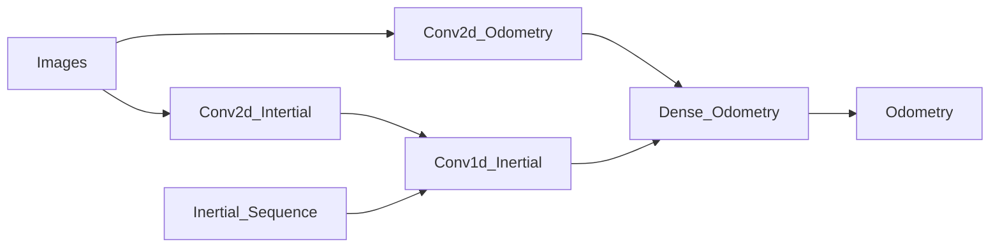

# Almost-VIO

Computer vision project about visual odometry

# Pipeline

# Dataset

source: https://github.com/AaltoVision/ADVIO (francesco)

## Utils

- **video_to_frame.py**: it extracts the frames from the video in order to prepare the data
- **sanitize_labels.py**: it checks if the frames extrated by _video_to_frame.py_ are present in the labels(_frames.csv_) in order to have coherent frames and labels

# Reference

- http://mrsl.grasp.upenn.edu/loiannog/tutorial_ICRA2016/VO_Tutorial.pdf (Blandinie)
