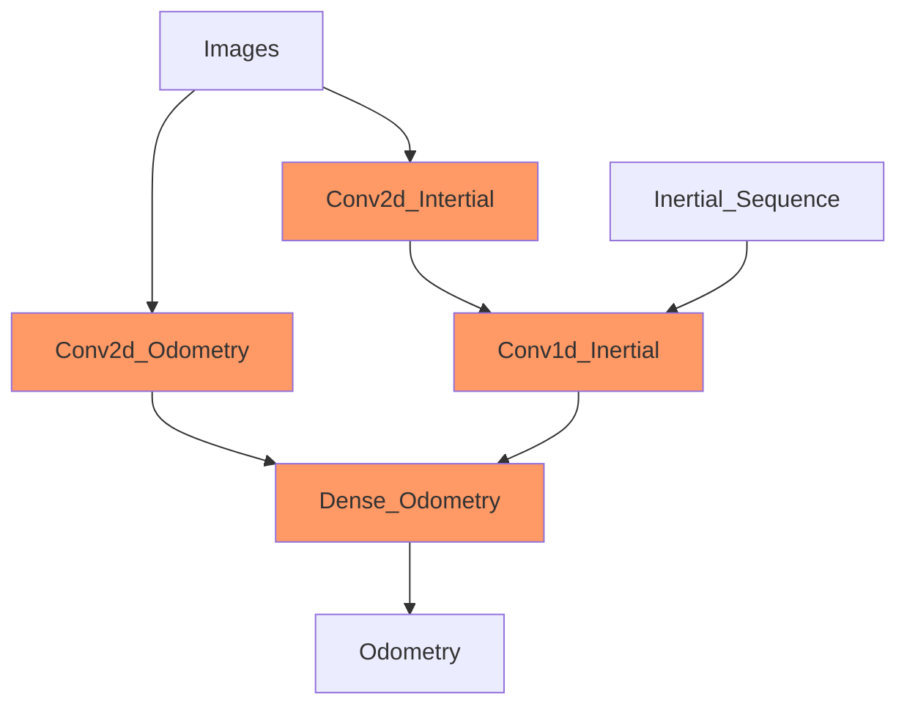

# Almost-VIO

The co-authors were all the contributors.

## Abstract

The estimation task of visual odometry (VO) suffers from approximation errors.
We address some of them by training a model to understand long term knowledge about physics by predicting sequence of inertial data.
This approach forces the model to consider both the short term (frames) and long term (inertial sequence) knowledge during the motion estimation.

During the training phase the inertial sequence comes directly from the dataset, meanwhile in the testing phase it’s **self-generated** by the model.

We found out that our solution enhance the common VO models at inference time, without requiring any additional data in input.

## Dataset

We decided to use the ADVIO dataset because it provides 23 walking scenes with variable occlusion and a lot of sensory recordings.
Among them it provides video, accellerometer, and ground truth for each timestep, that are necessary for our task.
Moreover the data are captured from commodity but modern devices, which makes a suitable dataset for real world scenario model trainig.

The dataset can be found at: https://github.com/AaltoVision/ADVIO

### Preprocessing

1. Resample of the 60Hz video frames to 50Hz in order to have exactly 2 intertial data (since are sampled at 100Hz) for each frame.
   Each timestamp in the 50Hz sampling is associated with the frame of the closest timestamp of the 60Hz samplig.

2. Sync the timestamp on the accellerometer, video frames and ground truth files.

3. The y and z of the accellerometer were corrected from m/s^2 to g's in order to match the unit measure of the x-axis

4. The frames are then resized (from 1280x720 to 224x224) and normalized.

5. Building a 2 sec buffer of inertials data.

### Data setup

The script **data_setup.sh** handles the data download, extraction and preparation for the training. It may take some hours.

:warning: Make sure to install all the requirements in your python enviroment before starting the script.

## Models

- **inertial_net_train.ipynb**: execute the training of our solution. Our pipeline is designed as follow

- **baseline_net_train.ipynb**: execute the training of the baseline. The baseline is just a MobileNetV3 that extract feature from frames and tries to predict the odometry values without any refinement steps.

## Results

We verified that our solution can successfully reduce the RMSE error with respect to the baseline.

| Solution         | Stopping epoch | Validation Loss (RMSE) |
| ---------------- | -------------- | ---------------------- |
| Baseline         | 191            | 1.64                   |
| **Our solution** | 215            | **1.45**               |

## Reference

- http://mrsl.grasp.upenn.edu/loiannog/tutorial_ICRA2016/VO_Tutorial.pdf
- https://www.alaakhamis.org/teaching/SPC418/reading/Visual%20odometry.pdf
- https://arxiv.org/pdf/1906.03289.pdf
- https://arxiv.org/pdf/1906.11435.pdf
- https://senwang.gitlab.io/DeepVO/files/wang2017DeepVO.pdf
