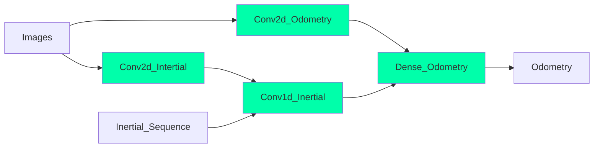

# Almost-VIO

Computer vision project about visual odometry

# Pipeline

# Dataset

Dataset source: https://github.com/AaltoVision/ADVIO

## Preprocessing

1. Resample the 60Hz video frames to 50Hz in order to have exactly 2 intertial data for each frame.

   Each timestamp in the 50Hz sampling is associated with the frame of the closest timestamp of the 60Hz samplig.

2. Sync the timestamp on the accellerometer, gyroscope, video frames and ground truth files

## Utils

- **video_to_frame.py**: it extracts the frames from the video in order to prepare the data
- **data_setup.py**: resample the video to a lower framerate (50Hz) and couple it with the correct frame

# Reference

- http://mrsl.grasp.upenn.edu/loiannog/tutorial_ICRA2016/VO_Tutorial.pdf (Blandinie)
