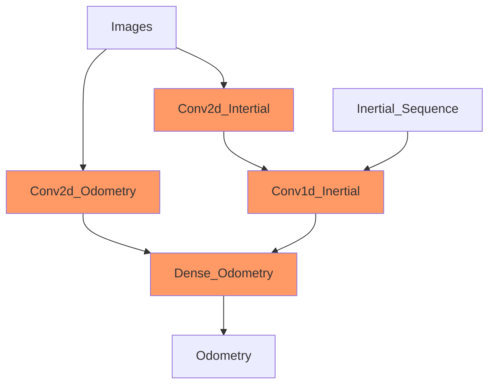

# Almost-VIO

Computer vision project about visual odometry

# Pipeline

# Dataset
We decided to use the ADVIO dataset because it provides 23 walking scenes with variable occlusion and a lot of sensory recordings.
Among them it provides video, accellerometer, and ground truth for each timestep, that are necessary for our task.
Moreover the data are captured from commodity but modern devices, which makes a suitable dataset for real world scenario model trainig.

The dataset can be found at: https://github.com/AaltoVision/ADVIO

## Preprocessing

1. Resample of the 60Hz video frames to 50Hz in order to have exactly 2 intertial data (since are sampled at 100Hz) for each frame.
   Each timestamp in the 50Hz sampling is associated with the frame of the closest timestamp of the 60Hz samplig.

2. Sync the timestamp on the accellerometer, video frames and ground truth files. 

3. The y and z of the accellerometer were corrected from m/s^2 to g's in order to match the unit measure of the x-axis

4. The frames are then resized (from 1280x720 to 224x224) and normalized.

5. Building a 2 sec buffer of inertials data. 

## Utils

- **video_to_frame.py**: it extracts the frames from the video in order to prepare the data
- **data_setup.py**: it does all the preprocessing on the data. 
(Warning: It may take **12 hours**)

# Reference

- http://mrsl.grasp.upenn.edu/loiannog/tutorial_ICRA2016/VO_Tutorial.pdf (Blandinie)
