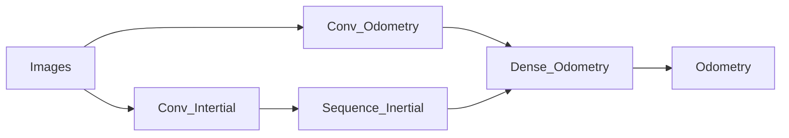

# Almost-VIO

Computer vision project about visual odometry

# Pipeline

# Dataset source

- https://vision.in.tum.de/data/datasets/visual-inertial-dataset (francesco)

# Reference

- http://mrsl.grasp.upenn.edu/loiannog/tutorial_ICRA2016/VO_Tutorial.pdf (Blandinie)
